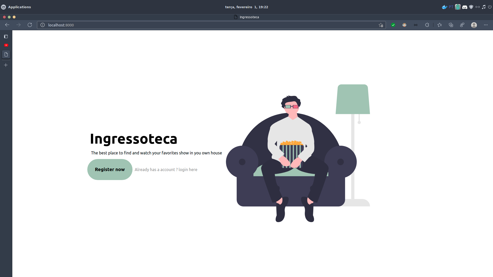
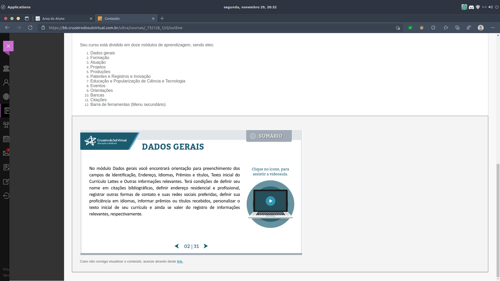
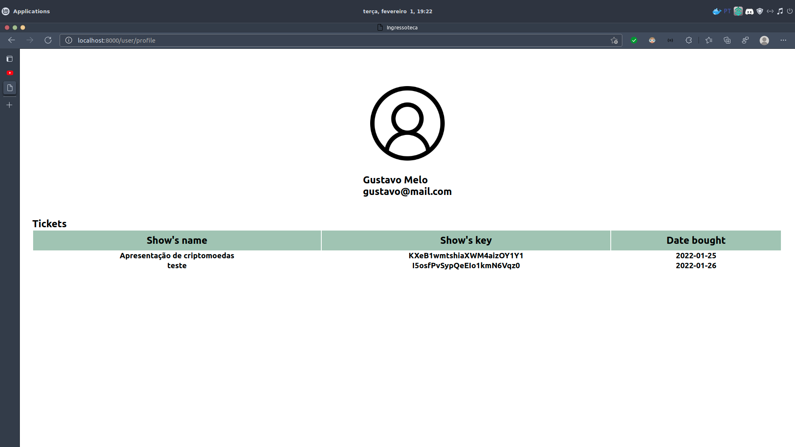
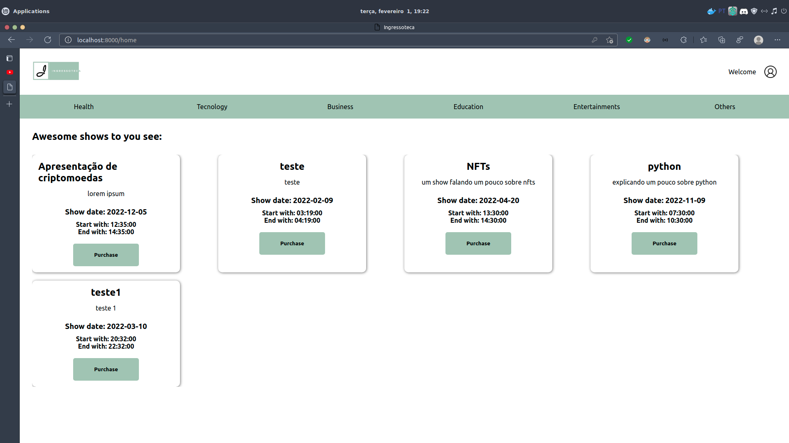
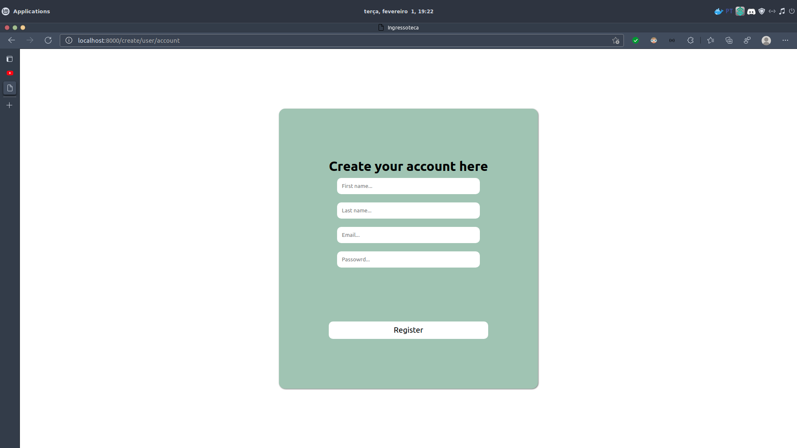
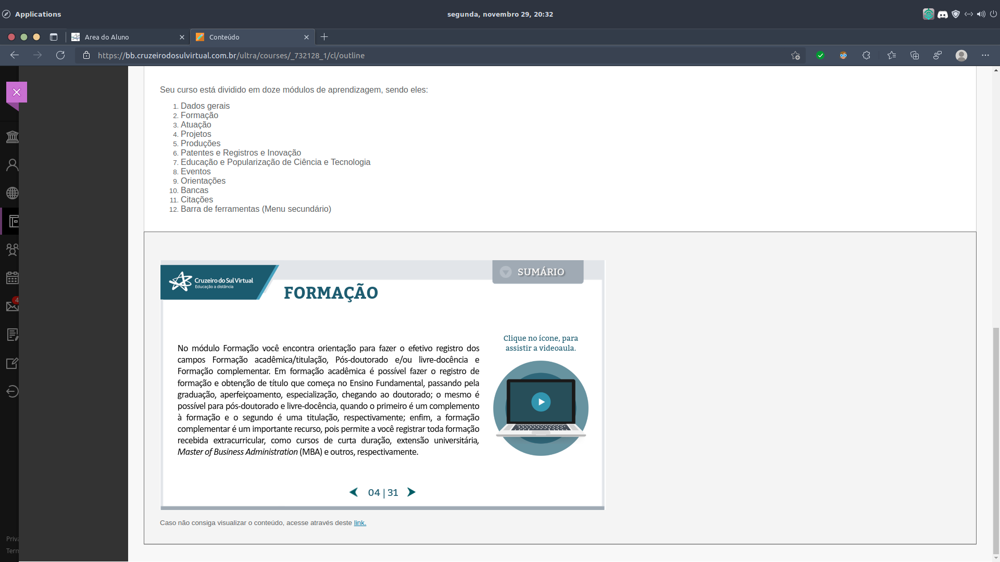

<h1 align="center">Ingressoteca</h1>

A software maded to manage tickets bought

    

<h2 align="center">Tecnologies used in project: </h2>

The main tecnology used in this project was Laravel, Blade and Javascript 

<table>
    <th>
        <td><h5>Tool name</h5></td>
        <td><h5>Version</h5></td>
    </th>
    <tr>
        <td></td>
        <td><small>PHP</small></td>
        <td><small>7.4.x</small></td>
    </tr>
        <td></td>
        <td><small>MySQL</small></td>
        <td><small>8.0.26</small></td>
    </tr>
        <td></td>
        <td><small>JS/Javascript</small></td>
        <td><small>6+</small></td>
    </tr>
        <td></td>
        <td><small>Composer</small></td>
        <td><small>2</small></td>
    </tr>
        <td></td>
        <td><small>PHPUnit</small></td>
        <td><small>9</small></td>
    </tr>
        <td></td>
        <td><small>Laravel</small></td>
        <td><small>8.x</small></td>
    </tr>
    <tr>
        <td></td>
        <td><small>php-jwt</small></td>
        <td><small>5.5</small></td>
    </tr>
</table>

<h2 align="center">Images of project: </h2>

<h2 align="center"> :clipboard: What I need to run this project ?</h2>

<ul>
    <li>MySQL</li>
    <li>Composer</li>
    <li>PHP</li>
</ul>

<h2 align="center"> :file_folder: How to run this project ? </h2>

<ul>
    <li>Clone the project</li>
    <li>Enter in terminal in cloned project</li>
    <li>Run `composer install`</li>
    <li>After that run `php artisan serve`</li>
    <li>Create and put your informations in: `.env`</li>
    <li>Open the browser and enter in: `http:://localhost:8000/`</li>
</ul>

<h3 align="center">Project created with :heartbeat: by Gustavo S. Melo </h3>
